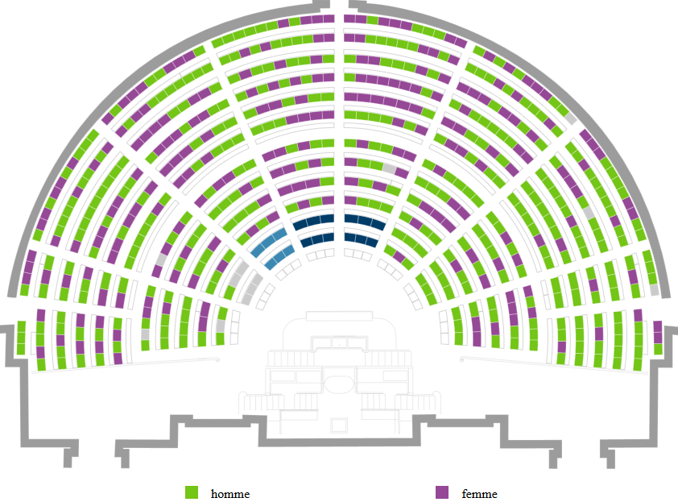
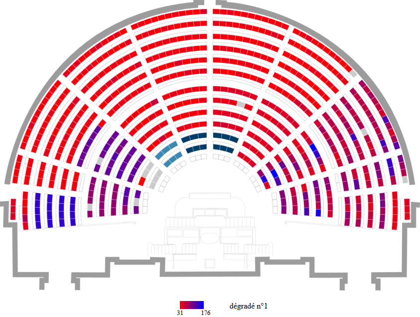

# hemicycle-france

[](https://travis-ci.org/Serrulien/hemicycle-france)

[hemicycle-france][hemicycle-france-online] est une application web permettant de produire des visuels représentant l'hémicycle de l’Assemblée nationale. Vous pouvez colorier chaque siège après importation de votre fichier de données (format CSV) et d'une éventuelle palette de couleur. De plus, il est possible d'exporter le visuel en fichier SVG, vous permettant d'effectuer des retouches avec aisance.

Chacun des 582 sièges disponibles aux députés peut être colorié en fonction de sa valeur. Ces valeurs sont définies dans le fichier de données et les couleurs sont définies dans la palette. Cependant, si aucune palette n'est renseignée alors les couleurs sont choisies aléatoirement.

L'outil représente les données catégorielles ou numériques. Typiquement les données dites catégorielles peuvent être le sexe des députés et les données numériques le nombre d'amendements proprosés.

|  |  
|:--:|:--:|
| données catégorielles  | données numériques |

Cet outil est utilisable en ligne sur https://serrulien.github.io/hemicycle-france/principale.html.  
Les fichiers importés doivent respecter un format particulier, nous vous recommendons de lire le manuel d'utilisation disponible sur https://serrulien.github.io/hemicycle-france/aide-utilisation.html.

## Conditions d'usage
Cet outil supporte les navigateurs Web récents dits "evergreen browsers" (Firefox, Chrome, Edge, Opera et Safari). Le support est focalisé sur les plateformes Desktop au lieu des plateformes mobiles et tablettes.

## Utiliser l'outil localement
Pour utiliser l'outil localement, télécharger la dernière version disponible sur https://github.com/Serrulien/hemicycle-france/releases. Décompressez l'archive puis ouvrez le fichier .html avec votre navigateur web.

## Contribuer
Vous pouvez soumettre des suggestions et signaler des problèmes cette [page](https://github.com/Serrulien/hemicycle-france/issues). Lors du signalement de problème, nous vous invitons à respecter les consignes énoncées dans le chapite [Signaler un problème](#signaler-un-problème).  
Si vous ne voulez pas utiliser la plateforme Github, vous pouvez envoyez votre message à [contact@julienserrurier.fr](mailto:contact@julienserrurier.fr?subject=[GitHub]%20hemicycle%20france).  
Pour les contributions de code, merci de respecter ce format de commit https://gist.github.com/abravalheri/34aeb7b18d61392251a2.

## Signaler un problème
Indiquez :
- votre navigateur et sa version
- une description exhaustive du problème. Un message d'erreur est-il affiché ?
- si possible une capture d'écran
- le problème est-il reproductible ? Si oui comment le reproduire ?
- si le problème est directement lié à une des fichiers importés, merci de joindre les fichiers (de préférence un fichier de contenu minimal).

## Où puis-je trouver les suggestions et problèmes connus ?
https://github.com/Serrulien/hemicycle-france/issues.

## Licence
Ce projet est licencié sous la licence MIT, voir ce [fichier](./LICENSE).  
La liste des dépendances de production dans ce [fichier](./DEPENDENCIES.md).

## Développeurs : scripts
```bash
git clone https://github.com/Serrulien/hemicycle-france
cd hemicycle-france/
npm i
```

pour tester : 
```bash
npm run test
```

pour build :
```bash
npm build-prod # fichiers compréssés, sans source-maps
#ou
npm build-dev # avec source-maps
firefox docs/principale.html
```

plus d'info dans l'objet `scripts` du fichier [package.json](./package.json).

## Status
L'outil est en développement et est donc activement maintenu.

[hemicycle-france-online]: https://serrulien.github.io/hemicycle-france/principale.html
[hemicycle-france-github]: https://github.com/Serrulien/hemicycle-france
